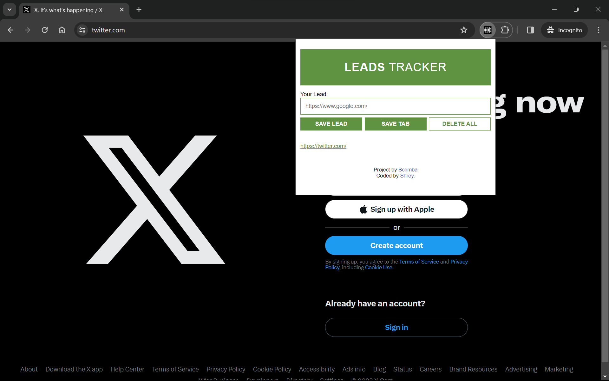

# Scrimba - Leads Tracker Chrome Extension 

This is a solution to the [Chrome extension leads tracker project on Scrimba](https://scrimba.com/learn/learnjavascript/). Scrimba helps you improve your coding skills by building realistic projects.

## Table of contents

- [Overview](#overview)
  - [The challenge](#the-challenge)
  - [Screenshot](#screenshot)
  - [Links](#links)
  - [How to install](#how-to-install)
- [My process](#my-process)
  - [Built with](#built-with)
  - [What I learned](#what-i-learned)
  - [Continued development](#continued-development)
  - [Useful resources](#useful-resources)
- [Author](#author)
- [Acknowledgments](#acknowledgments)

## Overview

### The challenge

Users should be able to:

- Save leads writing them into the input element
- Save the current Chrome tab in the list
- Maintain leads even after closing the browser
- Delete all leads by double clicking on the last button
- See hover states for interactive elements

### Screenshot

### Links

- Solution URL: [@GitHub](https://github.com/Percobain/leads_tracker_chrome_extension)
- Live Site URL: [@GitHub](https://percobain.github.io/leads_tracker_chrome_extension/)

### How to install

- Clone Repo or Download Zip: [Zip file](https://github.com/Percobain/leads_tracker_chrome_extension/blob/main/leads_tracker.zip)
- Visit chrome://extensions/ and turn on "Developer mode"
- Click "Load unpacked" button and navigate to the folder you downloaded
- That's it! 🎉

## Author

- LinkedIn - [Shreyans Tatiya](https://www.linkedin.com/in/shreyans-tatiya-8845a2274/)

## Acknowledgments

A big thank you to [Per Harald Borgen](https://github.com/perborgen) who is a pleasure to listen to and to learn new things in a funny and interactive way 👏
